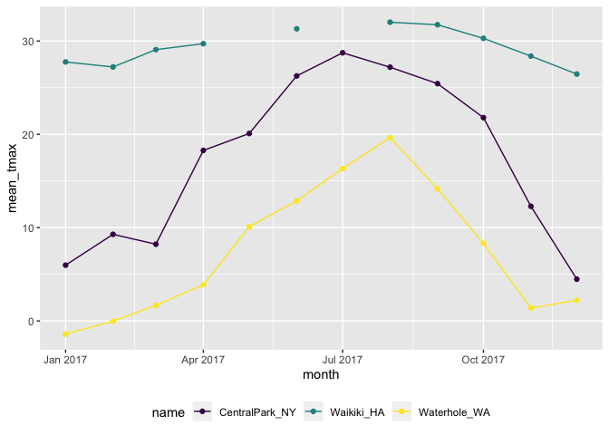

10.3.2019
================

``` r
# Bringing in the dataset again, lubridate = package we don't really need so thats why we use two ::
weather_df = 
  rnoaa::meteo_pull_monitors(c("USW00094728", "USC00519397", "USS0023B17S"),
                      var = c("PRCP", "TMIN", "TMAX"), 
                      date_min = "2017-01-01",
                      date_max = "2017-12-31") %>%
  mutate(
    name = recode(id, USW00094728 = "CentralPark_NY", 
                      USC00519397 = "Waikiki_HA",
                      USS0023B17S = "Waterhole_WA"),
    tmin = tmin / 10,
    tmax = tmax / 10,
    month = lubridate::floor_date(date, unit = "month")) %>%
  select(name, id, date, month, everything())
```

    ## Registered S3 method overwritten by 'crul':
    ##   method                 from
    ##   as.character.form_file httr

    ## Registered S3 method overwritten by 'hoardr':
    ##   method           from
    ##   print.cache_info httr

    ## file path:          /Users/hannahbowlin/Library/Caches/rnoaa/ghcnd/USW00094728.dly

    ## file last updated:  2019-09-26 10:22:50

    ## file min/max dates: 1869-01-01 / 2019-09-30

    ## file path:          /Users/hannahbowlin/Library/Caches/rnoaa/ghcnd/USC00519397.dly

    ## file last updated:  2019-09-26 10:22:59

    ## file min/max dates: 1965-01-01 / 2019-09-30

    ## file path:          /Users/hannahbowlin/Library/Caches/rnoaa/ghcnd/USS0023B17S.dly

    ## file last updated:  2019-09-26 10:23:02

    ## file min/max dates: 1999-09-01 / 2019-09-30

``` r
# Grouping by name and month, haven't fundamentally alter the weather_df dataset, just temporarily change how it looks
weather_df %>%
  group_by(name, month)
```

    ## # A tibble: 1,095 x 7
    ## # Groups:   name, month [36]
    ##    name           id          date       month       prcp  tmax  tmin
    ##    <chr>          <chr>       <date>     <date>     <dbl> <dbl> <dbl>
    ##  1 CentralPark_NY USW00094728 2017-01-01 2017-01-01     0   8.9   4.4
    ##  2 CentralPark_NY USW00094728 2017-01-02 2017-01-01    53   5     2.8
    ##  3 CentralPark_NY USW00094728 2017-01-03 2017-01-01   147   6.1   3.9
    ##  4 CentralPark_NY USW00094728 2017-01-04 2017-01-01     0  11.1   1.1
    ##  5 CentralPark_NY USW00094728 2017-01-05 2017-01-01     0   1.1  -2.7
    ##  6 CentralPark_NY USW00094728 2017-01-06 2017-01-01    13   0.6  -3.8
    ##  7 CentralPark_NY USW00094728 2017-01-07 2017-01-01    81  -3.2  -6.6
    ##  8 CentralPark_NY USW00094728 2017-01-08 2017-01-01     0  -3.8  -8.8
    ##  9 CentralPark_NY USW00094728 2017-01-09 2017-01-01     0  -4.9  -9.9
    ## 10 CentralPark_NY USW00094728 2017-01-10 2017-01-01     0   7.8  -6  
    ## # … with 1,085 more rows

``` r
#Counting the number of things that exist in these groups
weather_df %>%
  group_by(month) %>%
  summarize(n_obs = n())
```

    ## # A tibble: 12 x 2
    ##    month      n_obs
    ##    <date>     <int>
    ##  1 2017-01-01    93
    ##  2 2017-02-01    84
    ##  3 2017-03-01    93
    ##  4 2017-04-01    90
    ##  5 2017-05-01    93
    ##  6 2017-06-01    90
    ##  7 2017-07-01    93
    ##  8 2017-08-01    93
    ##  9 2017-09-01    90
    ## 10 2017-10-01    93
    ## 11 2017-11-01    90
    ## 12 2017-12-01    93

``` r
#Gives the count of weather observations per month
```

``` r
# number of observations for each month and as a unique date
weather_df %>%
  group_by(month) %>%
  summarize(n = n(),
            n_unique = n_distinct(date))
```

    ## # A tibble: 12 x 3
    ##    month          n n_unique
    ##    <date>     <int>    <int>
    ##  1 2017-01-01    93       31
    ##  2 2017-02-01    84       28
    ##  3 2017-03-01    93       31
    ##  4 2017-04-01    90       30
    ##  5 2017-05-01    93       31
    ##  6 2017-06-01    90       30
    ##  7 2017-07-01    93       31
    ##  8 2017-08-01    93       31
    ##  9 2017-09-01    90       30
    ## 10 2017-10-01    93       31
    ## 11 2017-11-01    90       30
    ## 12 2017-12-01    93       31

``` r
#number of unique obs in each name (NY, HA, and WA)
weather_df %>%
  count(name)
```

    ## # A tibble: 3 x 2
    ##   name               n
    ##   <chr>          <int>
    ## 1 CentralPark_NY   365
    ## 2 Waikiki_HA       365
    ## 3 Waterhole_WA     365

``` r
#number of unique obs per month
weather_df %>%
  count(month)
```

    ## # A tibble: 12 x 2
    ##    month          n
    ##    <date>     <int>
    ##  1 2017-01-01    93
    ##  2 2017-02-01    84
    ##  3 2017-03-01    93
    ##  4 2017-04-01    90
    ##  5 2017-05-01    93
    ##  6 2017-06-01    90
    ##  7 2017-07-01    93
    ##  8 2017-08-01    93
    ##  9 2017-09-01    90
    ## 10 2017-10-01    93
    ## 11 2017-11-01    90
    ## 12 2017-12-01    93

``` r
#number of unique obs per month
weather_df %>%
  count(name, month)
```

    ## # A tibble: 36 x 3
    ##    name           month          n
    ##    <chr>          <date>     <int>
    ##  1 CentralPark_NY 2017-01-01    31
    ##  2 CentralPark_NY 2017-02-01    28
    ##  3 CentralPark_NY 2017-03-01    31
    ##  4 CentralPark_NY 2017-04-01    30
    ##  5 CentralPark_NY 2017-05-01    31
    ##  6 CentralPark_NY 2017-06-01    30
    ##  7 CentralPark_NY 2017-07-01    31
    ##  8 CentralPark_NY 2017-08-01    31
    ##  9 CentralPark_NY 2017-09-01    30
    ## 10 CentralPark_NY 2017-10-01    31
    ## # … with 26 more rows

``` r
weather_df %>%
  count(month, name = "n_days")
```

    ## # A tibble: 12 x 2
    ##    month      n_days
    ##    <date>      <int>
    ##  1 2017-01-01     93
    ##  2 2017-02-01     84
    ##  3 2017-03-01     93
    ##  4 2017-04-01     90
    ##  5 2017-05-01     93
    ##  6 2017-06-01     90
    ##  7 2017-07-01     93
    ##  8 2017-08-01     93
    ##  9 2017-09-01     90
    ## 10 2017-10-01     93
    ## 11 2017-11-01     90
    ## 12 2017-12-01     93

``` r
# don't use base r "table" becaue you have to pull the data, does the same thing, but much less 
# pretty and not a data frame so can't do anything else after 
weather_df %>%
  pull(month) %>% 
  table
```

    ## .
    ## 2017-01-01 2017-02-01 2017-03-01 2017-04-01 2017-05-01 2017-06-01 
    ##         93         84         93         90         93         90 
    ## 2017-07-01 2017-08-01 2017-09-01 2017-10-01 2017-11-01 2017-12-01 
    ##         93         93         90         93         90         93

``` r
weather_df %>%
  group_by(month) %>%
  summarize(
    n_obs = n(),
    n_days = n_distinct(date))
```

    ## # A tibble: 12 x 3
    ##    month      n_obs n_days
    ##    <date>     <int>  <int>
    ##  1 2017-01-01    93     31
    ##  2 2017-02-01    84     28
    ##  3 2017-03-01    93     31
    ##  4 2017-04-01    90     30
    ##  5 2017-05-01    93     31
    ##  6 2017-06-01    90     30
    ##  7 2017-07-01    93     31
    ##  8 2017-08-01    93     31
    ##  9 2017-09-01    90     30
    ## 10 2017-10-01    93     31
    ## 11 2017-11-01    90     30
    ## 12 2017-12-01    93     31

``` r
# creating a table for "cold" and "not cold", coding it into binary variables
# TRUE  ~" is the case when, so if there's a blank spot you skip it
weather_df %>% 
  mutate(
    cold = case_when(
      tmax < 5 ~ "cold",
      tmax >=5 ~ "not_cold",
      TRUE     ~ ""
  )) %>%
  filter(name != "Waikiki_HA") %>% 
  group_by(name, cold) %>% 
  summarize(count = n()) 
```

    ## # A tibble: 4 x 3
    ## # Groups:   name [2]
    ##   name           cold     count
    ##   <chr>          <chr>    <int>
    ## 1 CentralPark_NY cold        44
    ## 2 CentralPark_NY not_cold   321
    ## 3 Waterhole_WA   cold       172
    ## 4 Waterhole_WA   not_cold   193

Let’s make a nice table

``` r
weather_df %>%
  count(name) %>%
  knitr::kable()
```

| name            |   n |
| :-------------- | --: |
| CentralPark\_NY | 365 |
| Waikiki\_HA     | 365 |
| Waterhole\_WA   | 365 |

``` r
weather_df %>% 
  mutate(
    cold = case_when(
      tmax < 5 ~ "cold",
      tmax >=5 ~ "not_cold",
      TRUE     ~ ""
  )) %>%
  janitor::tabyl(name, cold)
```

    ##            name V1 cold not_cold
    ##  CentralPark_NY  0   44      321
    ##      Waikiki_HA  3    0      362
    ##    Waterhole_WA  0  172      193

``` r
#tabyl in janitor package also makes nice table
```

``` r
#putting in values from different variables (median, mean, sd, for tmax and prec)
weather_df %>%
  group_by(month) %>%
  summarize(
    mean_tmax = mean(tmax),
    mean_prec = mean(prcp, na.rm = TRUE),
    median_tmax = median(tmax),
    sd_tmax = sd(tmax))
```

    ## # A tibble: 12 x 5
    ##    month      mean_tmax mean_prec median_tmax sd_tmax
    ##    <date>         <dbl>     <dbl>       <dbl>   <dbl>
    ##  1 2017-01-01      10.8     37.0          6.1   13.1 
    ##  2 2017-02-01      12.2     57.9          8.3   12.1 
    ##  3 2017-03-01      13.0     54.6          8.3   12.4 
    ##  4 2017-04-01      17.3     32.9         18.3   11.2 
    ##  5 2017-05-01      NA       28.4         NA     NA   
    ##  6 2017-06-01      23.5     18.7         27.2    8.73
    ##  7 2017-07-01      NA       12.7         NA     NA   
    ##  8 2017-08-01      26.3     10.2         27.2    5.87
    ##  9 2017-09-01      23.8      9.94        26.1    8.42
    ## 10 2017-10-01      20.1     41.5         22.2    9.75
    ## 11 2017-11-01      14.0     61.5         12.0   11.6 
    ## 12 2017-12-01      11.0     40.2          8.9   11.9

``` r
weather_df %>%
  group_by(name, month) %>%
  summarize(
    mean_tmax = mean(tmax),
    median_tmax = median(tmax))
```

    ## # A tibble: 36 x 4
    ## # Groups:   name [3]
    ##    name           month      mean_tmax median_tmax
    ##    <chr>          <date>         <dbl>       <dbl>
    ##  1 CentralPark_NY 2017-01-01      5.98         6.1
    ##  2 CentralPark_NY 2017-02-01      9.28         8.3
    ##  3 CentralPark_NY 2017-03-01      8.22         8.3
    ##  4 CentralPark_NY 2017-04-01     18.3         18.3
    ##  5 CentralPark_NY 2017-05-01     20.1         19.4
    ##  6 CentralPark_NY 2017-06-01     26.3         27.2
    ##  7 CentralPark_NY 2017-07-01     28.7         29.4
    ##  8 CentralPark_NY 2017-08-01     27.2         27.2
    ##  9 CentralPark_NY 2017-09-01     25.4         26.1
    ## 10 CentralPark_NY 2017-10-01     21.8         22.2
    ## # … with 26 more rows

``` r
#Visual summary of the data frame we just made
weather_df %>%
  group_by(name, month) %>%
  summarize(mean_tmax = mean(tmax)) %>%
  ggplot(aes(x = month, y = mean_tmax, color = name)) + 
    geom_point() + geom_line() + 
    theme(legend.position = "bottom")
```

    ## Warning: Removed 2 rows containing missing values (geom_point).

<!-- -->
