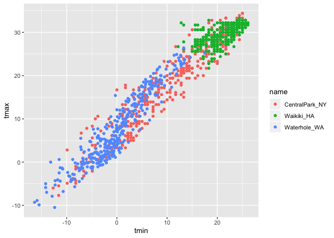

9.26.2019
================

# Weather Data

``` r
weather_df = 
  rnoaa::meteo_pull_monitors(c("USW00094728", "USC00519397", "USS0023B17S"),
                      var = c("PRCP", "TMIN", "TMAX"), 
                      date_min = "2017-01-01",
                      date_max = "2017-12-31") %>%
  mutate(
    name = recode(id, USW00094728 = "CentralPark_NY", 
                      USC00519397 = "Waikiki_HA",
                      USS0023B17S = "Waterhole_WA"),
    tmin = tmin / 10,
    tmax = tmax / 10) %>%
  select(name, id, everything())
```

    ## Registered S3 method overwritten by 'crul':
    ##   method                 from
    ##   as.character.form_file httr

    ## Registered S3 method overwritten by 'hoardr':
    ##   method           from
    ##   print.cache_info httr

    ## file path:          /Users/hannahbowlin/Library/Caches/rnoaa/ghcnd/USW00094728.dly

    ## file last updated:  2019-09-26 10:22:50

    ## file min/max dates: 1869-01-01 / 2019-09-30

    ## file path:          /Users/hannahbowlin/Library/Caches/rnoaa/ghcnd/USC00519397.dly

    ## file last updated:  2019-09-26 10:22:59

    ## file min/max dates: 1965-01-01 / 2019-09-30

    ## file path:          /Users/hannahbowlin/Library/Caches/rnoaa/ghcnd/USS0023B17S.dly

    ## file last updated:  2019-09-26 10:23:02

    ## file min/max dates: 1999-09-01 / 2019-09-30

``` r
weather_df
```

    ## # A tibble: 1,095 x 6
    ##    name           id          date        prcp  tmax  tmin
    ##    <chr>          <chr>       <date>     <dbl> <dbl> <dbl>
    ##  1 CentralPark_NY USW00094728 2017-01-01     0   8.9   4.4
    ##  2 CentralPark_NY USW00094728 2017-01-02    53   5     2.8
    ##  3 CentralPark_NY USW00094728 2017-01-03   147   6.1   3.9
    ##  4 CentralPark_NY USW00094728 2017-01-04     0  11.1   1.1
    ##  5 CentralPark_NY USW00094728 2017-01-05     0   1.1  -2.7
    ##  6 CentralPark_NY USW00094728 2017-01-06    13   0.6  -3.8
    ##  7 CentralPark_NY USW00094728 2017-01-07    81  -3.2  -6.6
    ##  8 CentralPark_NY USW00094728 2017-01-08     0  -3.8  -8.8
    ##  9 CentralPark_NY USW00094728 2017-01-09     0  -4.9  -9.9
    ## 10 CentralPark_NY USW00094728 2017-01-10     0   7.8  -6  
    ## # … with 1,085 more rows

``` r
##
## Create a ggplot, aes= aesthetic mapping we care about, without geompoint() we don't have anything on our graph
## geompoint() at a point at each x/y variable we will put a point
##
ggplot(weather_df, aes(x = tmin, y = tmax)) + 
  geom_point()
```

    ## Warning: Removed 15 rows containing missing values (geom_point).

<!-- -->

``` r
##
## 
```

# Different aesthetic mapping

``` r
weather_df %>%
  ggplot(aes(x = tmin, y = tmax)) +
  geom_point()
```

    ## Warning: Removed 15 rows containing missing values (geom_point).

<!-- -->

``` r
##
## Another way of making above ggplot
```

## Filtering by specific variable name

``` r
weather_df %>% filter(name == "Central_Park_NY")
```

    ## # A tibble: 0 x 6
    ## # … with 6 variables: name <chr>, id <chr>, date <date>, prcp <dbl>,
    ## #   tmax <dbl>, tmin <dbl>

# saving plot with a name (plot\_weather)

``` r
plot_weather = 
  weather_df %>%
  ggplot(aes(x = tmin, y = tmax))

plot_weather + geom_point()
```

    ## Warning: Removed 15 rows containing missing values (geom_point).

<!-- -->

Adding color…

``` r
ggplot(weather_df, aes(x = tmin, y = tmax)) + 
  geom_point(aes(color = name))
```

    ## Warning: Removed 15 rows containing missing values (geom_point).

<!-- -->

``` r
##
## Adding color into the different points, each color represents a different name (weather station location)
```
